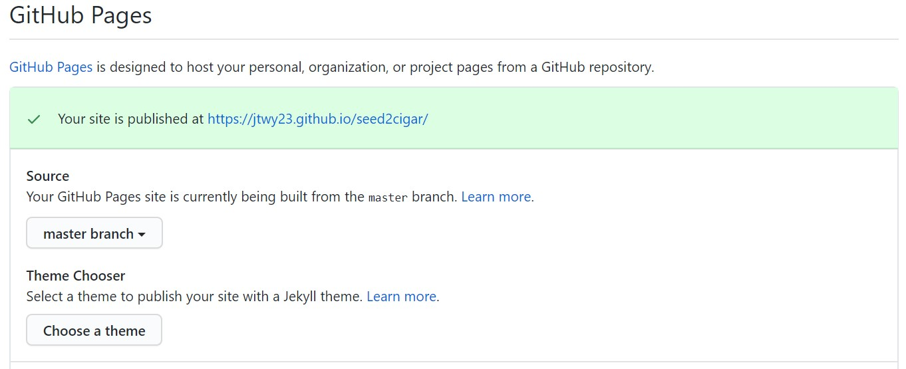

# SEED 2 CIGAR

---

---

## Table of Contents
- [UX](#ux)
- [Strategy Plane](#strategy-plane)
- [Scope Plane](#scope-plane)
- [Structure Plane](#structure-plane)
- [Skeleton Plane](#skeleton-plane)
- [Surface Plane](#surface-plane)
- [Features](#features)
- [Technologies Used](#technologies-used)
- [Testing](#testing)
- [Responsive](#responsive)
- [Deployment](#deployment)
- [Credits](#credits)
- [Disclaimer](#disclaimer)

This is a five page website designed to be more like a single scrolling page website project. 
It consists of 6 sections including Home, Cigar Globe, Cigar Journey, Cigar Talk, Cigar Quiz and Contact 
sections. The reason for the extra pages is the Cigar Quiz that was developed for an enhanced user 
experience.  The main aim of this project is for new cigar enthusiasts to come and visit the website and learn 
about the main points of cigar culture and be able to navigate easily through the website to get to the 
information they require. This website contains simple, easy to understand information to help the user get 
around cigar culture. Such as the ‘Cigar Globe’ section where the user can learn about the main cigar producing 
countries of the world. The ‘Cigar Journey’ section has an easy to navigate section for a user to learn and 
understand how a cigar is made from start to finish. Or like the ‘Cigar Talk’ section which gives a list of 
terms they may come across in the early stages of their own cigar journey. The ‘Contact’ section is a simple 
design to allow users to feel comfortable in reaching out for any cigar related questions they may have. I have 
also included a ‘Cigar Quiz’ section as an added extra interactivity for the user to somewhat test their own 
knowledge of what they have learned from this website. The website can be seen [here](https://jtwy23.github.io/seed2cigar/).

---

## UX

To develop this website we have broken down the UX into its five planes to define the client’s needs.

### Strategy Plane
| Client Goals                                                  | User Stories                                                                                                |
|-------------------------------------------------------------  |-----------------------------------------------------------------------------------------------------------|
| To have an easy to understand website.                        | As a user, I want to be able to learn more about the cigar process.                                       |
| The website should be easy for any user to navigate.          | As a user, I want to better understand cigar terms I see in other websites and social media.              |
| A simple way for users to contact us for any related queries. | As a user, I want to know where the main cigar producing countries are.                                   |
| The design of the website to be simple and inviting.          | As a user, I want to be able to get in touch with someone knowledgeable in cigars to answer my questions. |
| The information given to users will be simple and helpful.    | As a user, I want to be able to test my own knowledge on cigars.                                          |
|                                                               | As a user, I want to better understand ring gauges on different cigars.                                   |                                                              

### Scope Plane
| Features Include:                   | Features Not Included (For future implementation):         |
|-------------------------------------|------------------------------------------------------------|
| Navigation Bar                      | Live Chat functionality                                    |
| Hero Image                          | Video Gallery for Cigar Tutorials                          |
| Google Maps API                     | More cigar questions when the website has more information |
| Bootstrap Accordion                 |                                                            |
| jQuery Alphabetical Navigation List |                                                            |
| Javascript Quiz                     |                                                            |
| EmailJS API                         |                                                            |
| Footer with Contact Information     |                                                            |

### Structure Plane
The website is designed to look like a single scrolling page. But for added user experience the cigar quiz 
does navigate away from the main site. But can be easily led back to the main site when on the quiz. 
When a user gets to the landing page they are instantly greeted with a sticky navigation bar. The user can 
easily scroll through each section of the website or use the sticky navigation bar at the top to get to each 
section of the website. 

### Skeleton Plane
To give the client a visual idea of the project wireframes were created with 
[Balsamiq Wireframes](https://balsamiq.com/). We have created 3 versions of the website on 
different viewing platforms. A desktop, mobile and tablet view to show the client how the 
website will render on different devices.

- [Desktop](https://github.com/jtwy23/seed2cigar/blob/master/mockups/Milestone%2002%20-%20Desktop.pdf)

- [Mobile](https://github.com/jtwy23/seed2cigar/blob/master/mockups/Milestone%2002%20-%20Mobile.pdf)

- [Tablet](https://github.com/jtwy23/seed2cigar/blob/master/mockups/Milestone%2002%20-%20Tablet.pdf)

### Surface Plane
To gain a simple and easy to read website the following design choices have been made.

- Font choices were ‘Cantarell’ and ‘Caveat’. For a more impactful heading ‘Caveat’ was used to grab the 
user’s attention. However, for ease of reading, sometimes, large amounts of text ‘Cantarell’ was used for 
a more eye pleasing read.

- Text colour used is #1e7e34. A dark shade of green to keep in line with the logo.

- Main body background colour was white. This added more contrast of the text colour making the text jump out 
enough for an easier read.

- Header and footer colour is rgb(52, 58, 64). A shade of black that works well with the green text.

---

## Features

-	The navigation is sticky to allow the user to always be able to navigate to and from each section. 
-	Hero Image at the landing page is for users to associate with the type of website they have reached. 
An impactful cigar image with some elegant text overlayed.
-	To show the main cigar making regions of the world Google Maps API has been implemented. An interactive 
map with small clusters that is clickable to allow users to see the top three cigar making factories or the 
top three cigar producing regions.
-	In the clients ‘Cigar Journey’ section there was quite a lot of information to view. Bootstrap Accordion 
has been applied to the website to breakdown the information into easy to read chunks of text and an image 
for each section that links to the information provided.
-	Used jQuery Alphabetical Navigation List in the clients ‘Cigar Talk’ section. As this is an A to Z of 
terms it was a better option to create this navigation list that allowed each letter to be clickable which in 
turn would show only the terms of that particular letter. This will make it much easier for a user to sift 
through all the cigar terms they may come across.
-	For the clients ‘Cigar Quiz’ section vanilla Javascript was used. It has a small question bank
that will randomise five questions at a time so the user will not get the same questions every time.
-	EmailJS  API was used to allow users to get in contact with the client.
-	The footer is a simple contact information with the logo. A nice way for the user to scroll through the 
site and have as a future reference the contact details of the website.

### Future Features
-	Live chat functionality for the website will be a great way for further interactivity for the user. 
Also for the client to have more exposure and be able to connect quickly with users.
-	A video gallery for users to see different types of tutorials to use in everyday cigar life will help a 
user expand on knowledge.

---

## Technologies Used
* [HTML5](https://en.wikipedia.org/wiki/HTML5)
    - The markup language used to structure and present the content onto the web.

* [CSS3](https://en.wikipedia.org/wiki/Cascading_Style_Sheets#CSS_3)
    - Used CSS to style the website.

* [Javascript](https://www.javascript.com/)
    - Used javascript to put logic into the website.

* [Boostrap version 4.5.0](https://getbootstrap.com/)
    - Framework used to create website.

* [Google Fonts](https://fonts.google.com/)
    - Used ['Cantarell'](https://fonts.google.com/specimen/Cantarell?query=cantarell) 
    font for all text on website and 
    ['Caveat'](https://fonts.google.com/specimen/Caveat?query=caveat) for all title headings.

* [Fontawesome](https://fontawesome.com/)
    - All icons were used from fontawesome.

* [Google Maps API](https://developers.google.com/maps/documentation/javascript/overview)
    - API used to produce the map for Cigar Globe section.

* [jQuery](https://jquery.com/)
    - The Alphabetical Navigation list was built with jQuery.

* [EmailJS API](https://www.emailjs.com/)
    - Emailing set up with this API to connect to clients email.

* [Balsamiq Wireframes](https://balsamiq.com/)
    - Used to create basic layout of the pages.

* [Pexels](https://www.pexels.com/)
    - Stock images taken from this website.

* [Pexabay](https://pixabay.com/)
    - Stock images taken from this website.

* [Unsplash](https://unsplash.com/)
    - Stock images taken from this website.

* [The Noun Project Favicon](https://thenounproject.com/)
    - Favicon creator.

---

## Testing

For all testing results please click [here](/TESTING.md).

---

## Bug Problems in Development

Throughout the build of this website I have come across quite a few problems and below is a list:

- Navigation Bar - The original idea for the navigation bar was to use 'data-scroll-spy' function
 so that as the user scrolls through the website the navbar headings will highlight onto each 
 section.
    - Fix - I eventually had to take out the 'data-scroll-spy' as the scroller was not highlighting
    at the correct sections. I used jQuery to allow the user to click on the navbar headings and
    land on the correct section instead of the scroller.

- Landing Page - A button was created for the start of the landing page so a user can press the button 
and start the experience on Cigar Globe. The colour scheme for this button is white but as the 
rest of the websites buttons will be green this did not suit.
    - Fix - The button colour was changed to green but did not match up to the background image
    therefore the 'Let's Start!' button was taken away due to design choice.

- Cigar Globe - The cigar factories list had some major troubles as <li> items. I couldn't get the
three tables to line up horizontally and spaced well. 
    - Fix - Instead of using them as three lists I changed it into a table which allowed me more
    freedom to manipulate the spacing issues I was having.

- Cigar Journey - I started with a jQuery accordion to setup this section. The accordion was simple
to code but as I was using the bootstrap framework the classes I created were being overidden and
making it very hard to work around.
Also had an issue with the cigar barn image. It just didn't want to resize with all the other images
on that section.
    - Fix - I took away the jQuery accordion and opted for the bootstrap accordion which instantly
    solved all my issues with classes.
    With the image problem I had to find a new image and replace it so it could be resized through
    CSS like the other images on the section.

- Cigar Quiz - The bugs came from the actual game page. There were two issues. One was the logo
was a link but spanned across the entire header. The second issue was the responsiveness.
    - Fix - The logo and the responsiveness was fixed by adding bootstrap framework onto all the 
    quiz pages. By using 'img-fluid' this allowed only the logo to be a clickable link back to the
    home page. As for responsiveness, bootstrap helped when reducing screen size so the text was 
    not squashed or overlapping.

- Contact - The main issue was the modal box. The idea was for a user to fill out the form and submit.
Then the modal box will appear to let the user know he/she has sent the email to the client. However,
if the form was not completed the user can still press the submit button and the modal box will open.
    - Fix - I had to move the modal javascript code to inside the promise. This then requires the 
    user to complete the form and get validated. Have the form sent and allow the success responsive
    to come back before the modal box is launched.

## Deployment

Github was used for deployment.

To publish the website, the following steps needs to be taken:

1. Open GitHub and go to your site's 'Repositories'
2. Go to 'Settings'
3. Scroll down until you see 'GitHub Pages'
4. Under GitHub pages, click on the dropdown under 'Source' and select the 'Master Branch' option
5. A green box should appear with the following message 'Your site is published at https://jtwy23.github.io/seed2cigar/'

---

## Github Pages

Clone Website To clone the website to work locally, follow the steps below:

1. Go to the main page of the GitHub repository and click on the dropdown menu 
'Clone or download'
2. Copy the URL and go to your local IDE (Integrated Development Environment)
3. In the terminal of your IDE type in 'git clone' and the paste the URL copied from 
step 2 Press Enter and the clone will be created

---

## Credits

### Content

- Cigar journey content is from the article in 
[Cigar Aficionado](https://www.cigaraficionado.com/article/from-seed-to-shelf-8494).

- Cigar talk content is from 
[Havana House](https://www.havanahouse.co.uk/glossary-of-cigar-terminology-blog/).

### Media

All images are from [Pexels](https://www.pexels.com/), [Pexabay](https://pixabay.com/) and
[Unsplash](https://unsplash.com/).

### Web Template

The original template that gave me inspiration for this web layout is from 
[Drew Ryan](https://w3newbie.com/courses).

### Cigar Quiz

The cigar quiz was created through [James Q Quick's](https://www.jamesqquick.com/) video
tutorial.

### Aknowledgements

- All [Code Institute](https://codeinstitute.net/) tutors who have helped me build my website. 
From helping me get EmailJS working to simple little errors I didn't see right away.

- My friend Chris who also helped me through some coding issues.

- All the friends and family that have tested my website.

---

## Disclaimer

This is only for educational purposes.

---
