# SEED 2 CIGAR

---

---

## Table of Contents
- [UX](#ux)
- [Strategy Plane](#strategy-plane)
- [Scope Plane](#scope-plane)
- [Structure Plane](#structure-plane)
- [Skeleton Plane](#skeleton-plane)
- [Surface Plane](#surface-plane)
- [Features](#features)
- [Technologies Used](#technologies-used)
- [Testing](#testing)
- [Responsive](#responsive)
- [Deployment](#deployment)
- [Credits](#credits)
- [Disclaimer](#disclaimer)

This is a five page website designed to be more like a single scrolling page website project. 
It consists of 6 sections including Home, Cigar Globe, Cigar Journey, Cigar Talk, Cigar Quiz and Contact 
sections. The reason for the extra pages is the Cigar Quiz that was developed for an enhanced user 
experience.  The main aim of this project is for new cigar enthusiasts to come and visit the website and learn 
about the main points of cigar culture and be able to navigate easily through the website to get to the 
information they require. This website contains simple, easy to understand information to help the user get 
around cigar culture. Such as the ‘Cigar Globe’ section where the user can learn about the main cigar producing 
countries of the world. The ‘Cigar Journey’ section has an easy to navigate section for a user to learn and 
understand how a cigar is made from start to finish. Or like the ‘Cigar Talk’ section which gives a list of 
terms they may come across in the early stages of their own cigar journey. The ‘Contact’ section is a simple 
design to allow users to feel comfortable in reaching out for any cigar related questions they may have. I have 
also included a ‘Cigar Quiz’ section as an added extra interactivity for the user to somewhat test their own 
knowledge of what they have learned from this website. The website can be seen [here](https://jtwy23.github.io/seed2cigar/).

---

## UX

To develop this website we have broken down the UX into its five planes to define the client’s needs.

### Strategy Plane
| Client Goals                                                  | User Goals                                                                                                |
|-------------------------------------------------------------  |-----------------------------------------------------------------------------------------------------------|
| To have an easy to understand website.                        | As a user, I want to be able to learn more about the cigar process.                                       |
| The website should be easy for any user to navigate.          | As a user, I want to better understand cigar terms I see in other websites and social media.              |
| A simple way for users to contact us for any related queries. | As a user, I want to know where the main cigar producing countries are.                                   |
| The design of the website to be simple and inviting.          | As a user, I want to be able to get in touch with someone knowledgeable in cigars to answer my questions. |
| The information given to users will be simple and helpful.    | As a user, I want to be able to test my own knowledge on cigars.                                          |
|                                                               | As a user, I want to better understand ring gauges on different cigars.                                   |
|                                                               | As a user, I want to know the purpose of some cigar sizes.                                                |
|                                                               | As a user, I would like to be able to learn more flavour profiles and understand the different flavours.  |
|                                                               | As a user, I want to know the difference from Cuban cigars to New World cigars.                           |
|                                                               | As a user, I want to know if the colour of the cigar determines the strength of the cigar.                |
|                                                               | As a user, I want to know the difference between hand rolled and machine rolled.                          |

### Scope Plane
| Features Include:                   | Features Not Included (For future implementation):         |
|-------------------------------------|------------------------------------------------------------|
| Navigation Bar                      | Live Chat functionality                                    |
| Hero Image                          | Video Gallery for Cigar Tutorials                          |
| Google Maps API                     | More cigar questions when the website has more information |
| Bootstrap Accordion                 |                                                            |
| jQuery Alphabetical Navigation List |                                                            |
| Javascript Quiz                     |                                                            |
| EmailJS API                         |                                                            |
| Footer with Contact Information     |                                                            |

### Structure Plane
The website is designed to look like a single scrolling page. But for added user experience the cigar quiz 
does navigate away from the main site. But can be easily led back to the main site when on the quiz. 
When a user gets to the landing page they are instantly greeted with a sticky navigation bar. The user can 
easily scroll through each section of the website or use the sticky navigation bar at the top to get to each 
section of the website. 

### Skeleton Plane
To give the client a visual idea of the project wireframes were created with Balsamiq. We have created 3 
versions of the website on different viewing platforms. A desktop, mobile and tablet view to show the client 
how the website will render on different devices.

- [Desktop](https://github.com/jtwy23/seed2cigar/blob/master/mockups/Milestone%2002%20-%20Desktop.pdf)

- [Mobile](https://github.com/jtwy23/seed2cigar/blob/master/mockups/Milestone%2002%20-%20Mobile.pdf)

- [Tablet](https://github.com/jtwy23/seed2cigar/blob/master/mockups/Milestone%2002%20-%20Tablet.pdf)

### Surface Plane
To gain a simple and easy to read website the following design choices have been made.

- Font choices were ‘Cantarell’ and ‘Caveat’. For a more impactful heading ‘Caveat’ was used to grab the 
user’s attention. However, for ease of reading, sometimes, large amounts of text ‘Cantarell’ was used for 
a more eye pleasing read.

- Text colour used is #1e7e34. A dark shade of green to keep in line with the logo.

- Main body background colour was white. This added more contrast of the text colour making the text jump out 
enough for an easier read.

- Header and footer colour is rgb(52, 58, 64). A shade of black that works well with the green text.

---

## Features

-	The navigation is sticky to allow the user to always be able to navigate to and from each section. 
-	Hero Image at the landing page is for users to associate with the type of website they have reached. 
An impactful cigar image with some elegant text overlayed.
-	To show the main cigar making regions of the world Google Maps API has been implemented. An interactive 
map with small clusters that is clickable to allow users to see the top three cigar making factories or the 
top three cigar producing regions.
-	In the clients ‘Cigar Journey’ section there was quite a lot of information to view. Bootstrap Accordion 
has been applied to the website to breakdown the information into easy to read chunks of text and an image 
for each section that links to the information provided.
-	Used jQuery Alphabetical Navigation List in the clients ‘Cigar Talk’ section. As this is an A to Z of 
terms it was a better option to create this navigation list that allowed each letter to be clickable which in 
turn would show only the terms of that particular letter. This will make it much easier for a user to sift 
through all the cigar terms they may come across.
-	For the clients ‘Cigar Quiz’ section vanilla Javascript was used. It has a small question bank
that will randomise five questions at a time so the user will not get the same questions every time.
-	EmailJS  API was used to allow users to get in contact with the client.
-	The footer is a simple contact information with the logo. A nice way for the user to scroll through the 
site and have as a future reference the contact details of the website.

### Future Features
-	Live chat functionality for the website will be a great way for further interactivity for the user. 
Also for the client to have more exposure and be able to connect quickly with users.
-	A video gallery for users to see different types of tutorials to use in everyday cigar life will help a 
user expand on knowledge.

---

## Technologies Used
* [HTML5](https://en.wikipedia.org/wiki/HTML5)
    - The markup language used to structure and present the content onto the web.

* [CSS3](https://en.wikipedia.org/wiki/Cascading_Style_Sheets#CSS_3)
    - Used CSS to style the website.

* [Javascript](https://www.javascript.com/)
    - Used javascript to put logic into the website.

* [Boostrap version 4.5.0](https://getbootstrap.com/)
    - Framework used to create website.

* [Google Fonts](https://fonts.google.com/)
    - Used ['Cantarell'](https://fonts.google.com/specimen/Cantarell?query=cantarell) 
    font for all text on website and 
    ['Caveat'](https://fonts.google.com/specimen/Caveat?query=caveat) for all title headings.

* [Fontawesome](https://fontawesome.com/)
    - All icons were used from fontawesome.

* [Google Maps API](https://developers.google.com/maps/documentation/javascript/overview)
    - API used to produce the map for Cigar Globe section.

* [jQuery](https://jquery.com/)
    - The Alphabetical Navigation list was built with jQuery.

* [EmailJS API](https://www.emailjs.com/)
    - Emailing set up with this API to connect to clients email.

* [Balsamiq Wireframes](https://balsamiq.com/)
    - Used to create basic layout of the pages.

* [Pexels](https://www.pexels.com/)
    - Stock images taken from this website.

* [Pexabay](https://pixabay.com/)
    - Stock images taken from this website.

* [Unsplash](https://unsplash.com/)
    - Stock images taken from this website.

* [The Noun Project Favicon](https://thenounproject.com/)
    - Favicon creator.

---

## Testing

### HTML5

I ran all the HTML code into [W3C Markup Validator](https://validator.w3.org/). Out of five pages there were no
errors. However there were two pages that had a warning for an empty heading. As javascript is implemented for
this project these two warnings can be ignored because when these pages load javascript will then populate
the heading. This is why it is left empty.

#### index.html
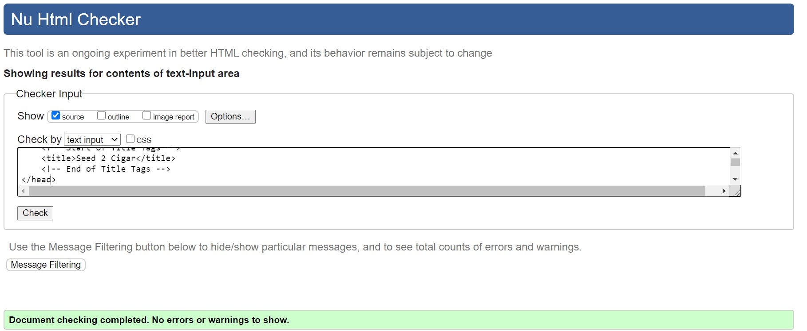
    - No errors or warnings.

#### cigargame.html
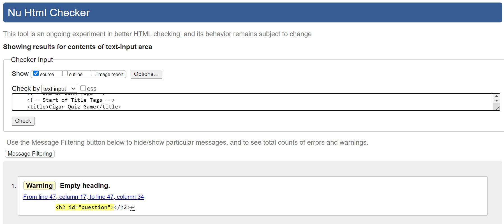
    - No errors but a warning for an empty heading. But javascript will populate the page when 
    loaded.

#### cigarquiz.html
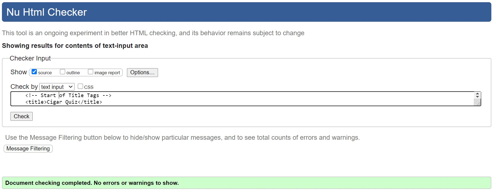
    - No errors or warnings.

#### end.html
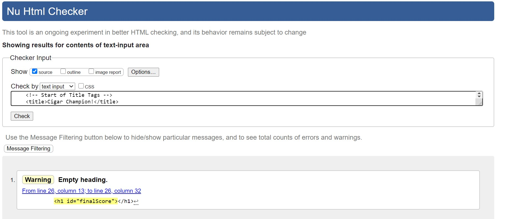
    - No errors but a warning for an empty heading. But javascript will populate the page when 
    loaded.

#### highscores.html
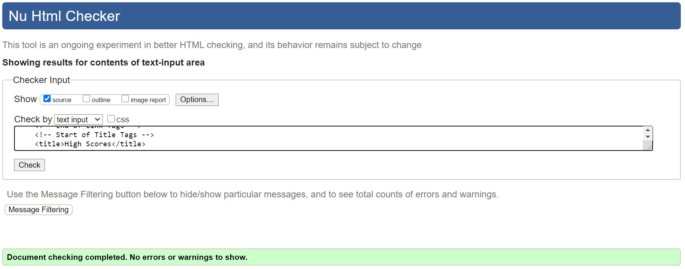
    - No errors or warnings.

---

### CSS

All style sheets were validated on [W3C CSS Validator](https://jigsaw.w3.org/css-validator/).
No errors came up for any of CSS file. There were two files that came up with a warning in 
regards to Google fonts CSS and ran that file through the validator that also came up with 
no errors.

#### app.css
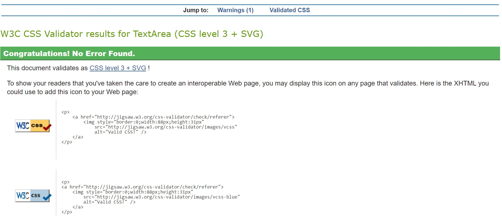

#### cigargame.css
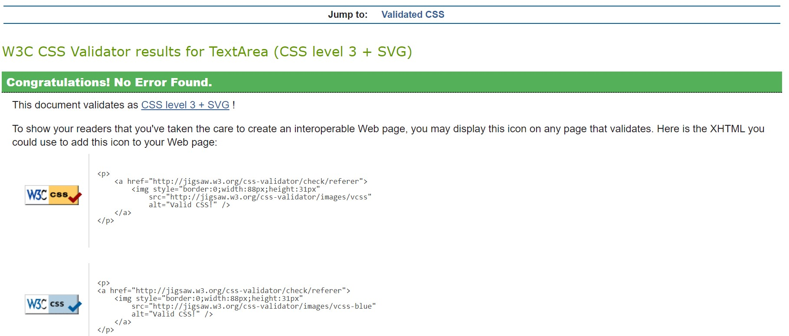

#### googlefonts.css
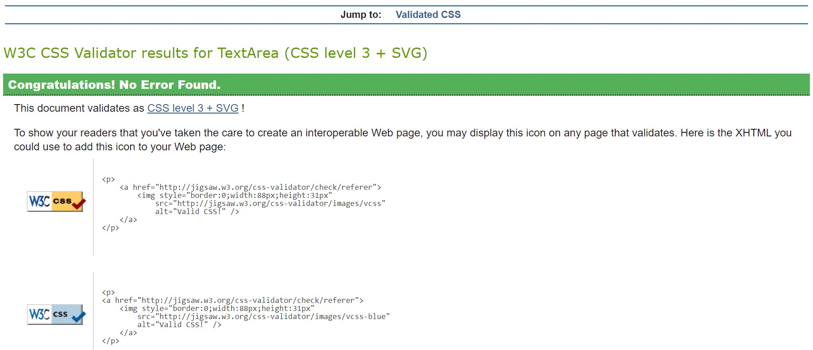

#### highscores.css
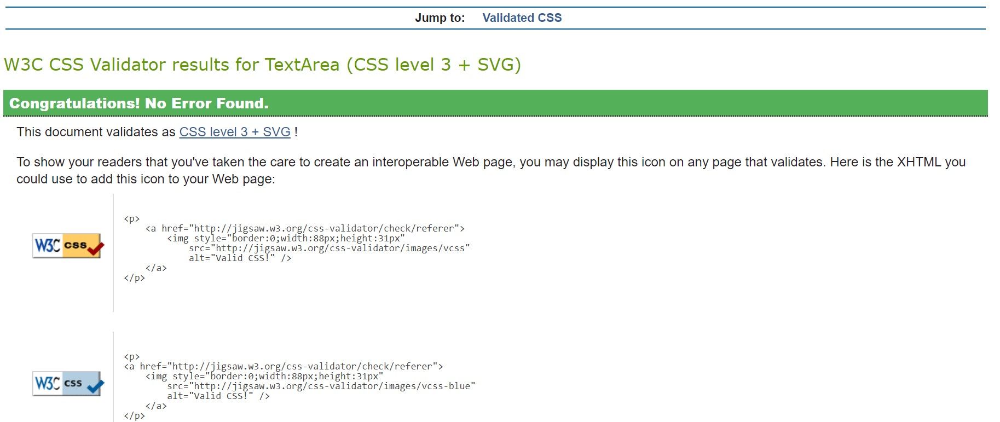

#### style.css
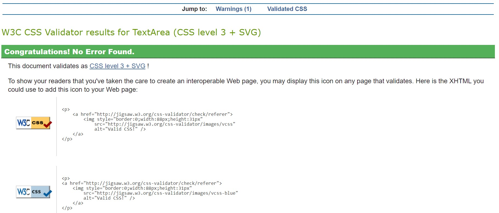

---

### Javascript

Running all the javascript code through [JSHint](https://jshint.com/) there were no errors that
was highlighted. There were some warnings for the but it was only towards users who are not using
ES6 enabaled web browsers. I further tested the viability of not changing the javascript code by
getting the target audience of this type of website to view the website and play the quiz with
no problems in loading and populating the appropriate parts of the quiz through javascript.

#### cigargame.js
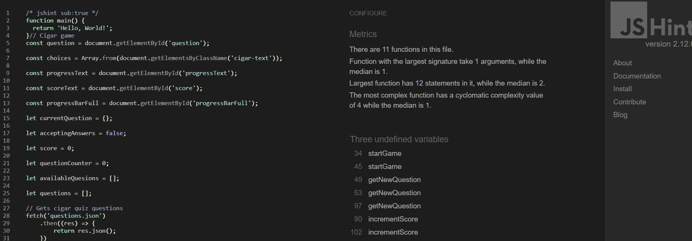

#### emailjs
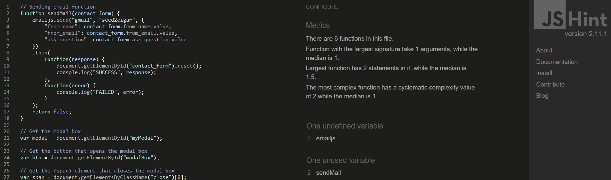

#### end.js
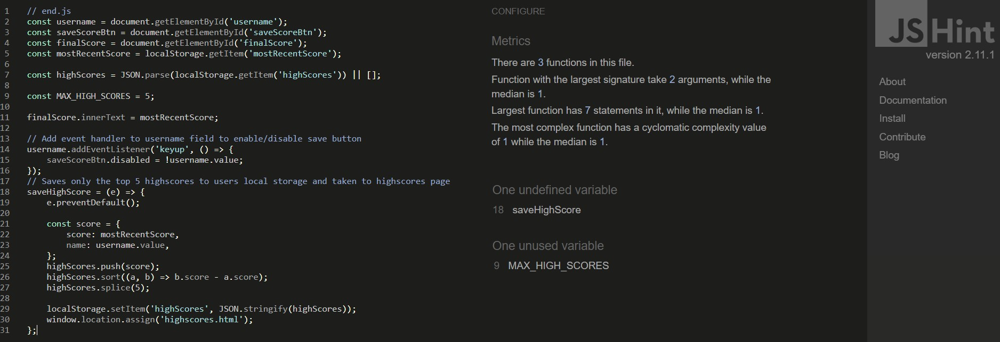

#### map.js
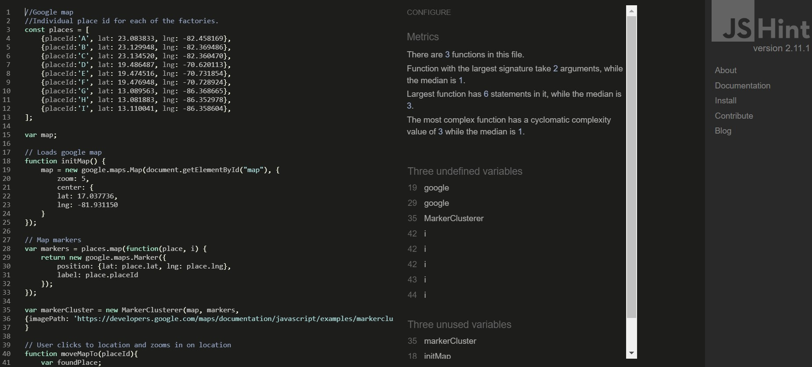

#### scripts.js

---

## Responsive

The responsiveness of this website was tested using [Am I Responsive](http://ami.responsivedesign.is/#).

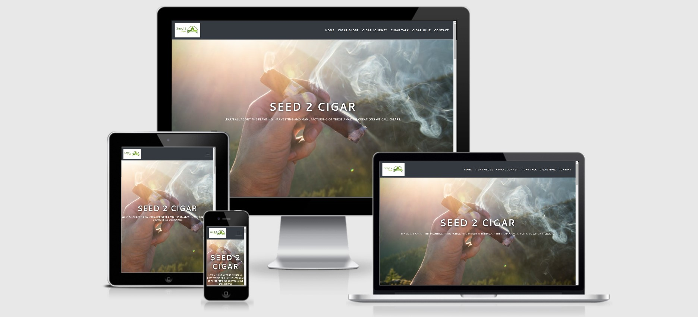

---

#### Header Section

The header is the sticky navigation bar which consists of the logo on the left and the six 
website sections. All sections were tested through clicking to get to the specified sections
and the logo is clicked to navigate back to the top of the page.

#### index.html Section

This is the single scrolling page which a user can navigate through the main part of the website
by either scrolling or using the navigation bar. I tested through both scrolling and using the
navigation bar with no problems. As all the sections are essentially on this one page I 
individually scrolled and clicked on the navigation bar to land on the section. 

On the Cigar Globe section the 
[Google Maps API](https://developers.google.com/maps/documentation/javascript/overview) loads 
well and shows the marker cluster. The text on this section allows users to hover over each 
factory name and click to show the user where the factory is and is identified with 
a letter corresponding to the letter next to the factory name.

Cigar Journey section is created with the 
[bootstrap accordion](https://getbootstrap.com/docs/4.3/components/collapse/#accordion-example). 
Each tab is clicked to show the next section and the last will collapse. The images were also 
tested for loading with no problems. The buttons too will highlight as the user hovers over each.
At the Cigar Talk section there is an alphabetical navigation list that is created through
[jQuery](https://jquery.com/). Each letter highlights when a user hovers over. Each click on a 
different letter will the show all the definitions for that letter. On load the A section is 
already loaded for the user to see.

On the Cigar Quiz section is the few times a user will navigate out of the main page. The quiz is 
created with [Javascript](https://www.javascript.com/). The button to go to the quiz highlights
and allows the user to click to the quiz.

The final section of the main page is the Contact section. It is a form with three fields. Name,
email and message. All fields are required before a user can send the message. 
[EmailJS API](https://www.emailjs.com/) is used to allow the user to contact the client. This 
too is tested and the email sends to the client seamlessly.

#### Cigar Quiz Section

When the user lands onto the Cigar Quiz section there is the logo which when clicked takes the
user back to the Home section. There are two additional buttons of Play and Highscores. These
buttons have box shadowing when the mouse hovers over. The Play button clicks through to the 
cigar quiz window and the Highscores takes the user to the Highscores list window.

#### Play Section

On the play screen there is a progress bar and score HUD which populates as the users progress.
The questions are randomly generated from the JSON file. There are four multiple choice 
answers a user can choose and when hovered over the each box is highlighted with box shadowing.
When a user clicks on a choice the box will either highlight green if correct or red when it is
wrong.

#### End Section

Once the game is finished the user is taken to the end section where there are a few choices.
The user can enter their name and save the score to their local storage so that they can always
see the score. They cannot save unless a name has been inputted. Once the save button is clicked
the user will be sent to the High Scores page.
They can also play again which will navigate them back to the quiz page. Or they can go home 
through the Go Home button or click the logo at the top of the page.

#### Highscores

This page will only show the top scores set by the user if the sixth score is higher than the
five on the page then the lowest score on the list is replaced. Again the user is given the 
choice of two buttons. Play Again will allow the user to navigate back to the quiz page or
Go Home to get back to the Home section of the website. They can also achieve this by clicking
the logo at the top.

#### Footer Section

The footer has the websites contact details and three social media icons. 
[Facebook](https://www.facebook.com/), [Instagram](https://www.instagram.com/) and 
[Twitter](https://twitter.com/) were tested to see if when these icons are clicked it navigates 
away to the respective page and opens on a new page so the user can get back to our site.

---

### Browser Test

|      Browser      | Good | Bad |
|:-----------------:|:----:|:---:|
|   Google Chrome   |   X  |     |
|      Firefox      |   X  |     |
|       Opera       |   X  |     |
|       Safari      |   X  |     |
|        Edge       |   X  |     |
| Internet Explorer |      |  X  |

In Internet Explorer the main part of the site is working well however the cigar quiz doesn't
populate the javascript code. This is because Internet Explorer is becoming very outdated and
the people that are still using IE browser is not the target audience the client is aiming for.

### Device Test

|    Device    | Good | Bad |
|:------------:|:----:|:---:|
|   Galaxy S5  |   X  |     |
|    Pixel 2   |   X  |     |
|  iPhone 5/SE |   X  |     |
| iPhone 6/7/8 |   X  |     |
|   iPhone X   |   X  |     |
|     iPad     |   X  |     |
|   iPad Pro   |   X  |     |
|  Surface Duo |   X  |     |

---

## Deployment

Github was used for deployment.

To publish the website, the following steps needs to be taken:

Open GitHub and go to your site's 'Repositories'
Go to 'Settings'
Scroll down until you see 'GitHub Pages'
Under GitHub pages, click on the dropdown under 'Source' and select the 'Master Branch' option
A green box should appear with the following message 
'Your site is published at https://jtwy23.github.io/seed2cigar/'

---

## Github Pages

Clone Website To clone the website to work locally, follow the steps below:

1. Go to the main page of the GitHub repository and click on the dropdown menu 
'Clone or download'
2. Copy the URL and go to your local IDE (Integrated Development Environment)
3. In the terminal of your IDE type in 'git clone' and the paste the URL copied from 
step 2 Press Enter and the clone will be created

---

## Credits

### Content

- Cigar journey content is from the article in 
[Cigar Aficionado](https://www.cigaraficionado.com/article/from-seed-to-shelf-8494).

- Cigar talk content is from 
[Havana House](https://www.havanahouse.co.uk/glossary-of-cigar-terminology-blog/).

### Media

All images are from [Pexels](https://www.pexels.com/), [Pexabay](https://pixabay.com/) and
[Unsplash](https://unsplash.com/).

### Web Template

The original template that gave me inspiration for this web layout is from 
[Drew Ryan](https://w3newbie.com/courses).

### Cigar Quiz

The cigar quiz was created through [James Q Quick's](https://www.jamesqquick.com/) video
tutorial.

### Aknowledgements

- All Code Institute tutors who have helped me build my website. From helping me get EmailJS working
to simple little errors I didn't see right away.

- My friend Chris who also helped me through some coding issues.

- All the friends and family that have tested my website.

---

## Disclaimer

This is only for educational purposes.

---

