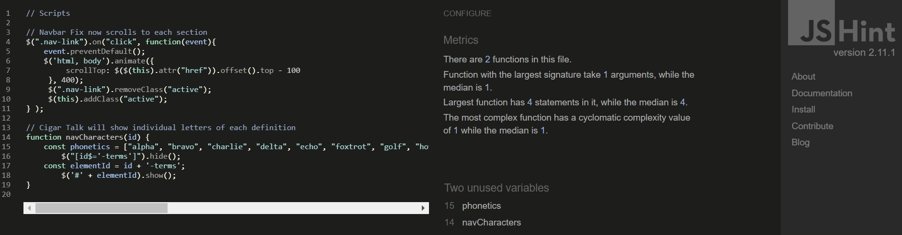

## Testing

As the testing has so many parts to the README.md I have seperated it from the main page to allow 
for easier reading.

### HTML5

I ran all the HTML code into [W3C Markup Validator](https://validator.w3.org/). Out of five pages there were no
errors. However there were two pages that had a warning for an empty heading. As javascript is implemented for
this project these two warnings can be ignored because when these pages load javascript will then populate
the heading. This is why it is left empty.

#### index.html

    - No errors or warnings.

#### cigargame.html

    - No errors but a warning for an empty heading. But javascript will populate the page when 
    loaded.

#### cigarquiz.html

    - No errors or warnings.

#### end.html

    - No errors but a warning for an empty heading. But javascript will populate the page when 
    loaded.

#### highscores.html

    - No errors or warnings.

---

### CSS

All style sheets were validated on [W3C CSS Validator](https://jigsaw.w3.org/css-validator/).
No errors came up for any of CSS file. There were two files that came up with a warning in 
regards to Google fonts CSS and ran that file through the validator that also came up with 
no errors.

#### app.css

#### cigargame.css

#### googlefonts.css

#### highscores.css

#### style.css

---

### Javascript

Running all the javascript code through [JSHint](https://jshint.com/) there were no errors. 
There were some warnings on the cigargame.js file but it was only because the code is written in 
ES6. I further tested the viability of the javascript code by getting the target audience to 
visit the website and play the quiz. All came back that the website loaded well and the quiz
populated the questions from the javascript.

#### cigargame.js

#### emailjs

#### end.js

#### map.js

#### scripts.js

---

## Responsive

The responsiveness of this website was tested using [Am I Responsive](http://ami.responsivedesign.is/#).

---

#### Header Section

The header is the sticky navigation bar which consists of the logo on the left and the six 
website sections. All sections were tested through clicking to get to the specified sections
and the logo is clicked to navigate back to the top of the page.

#### index.html Section

This is the single scrolling page which a user can navigate through the main part of the website
by either scrolling or using the navigation bar. I tested through both scrolling and using the
navigation bar with no problems. As all the sections are essentially on this one page I 
individually scrolled and clicked on the navigation bar to land on the section. 

On the Cigar Globe section the 
[Google Maps API](https://developers.google.com/maps/documentation/javascript/overview) loads 
well and shows the marker cluster. The text on this section allows users to hover over each 
factory name and click to show the user where the factory is and is identified with 
a letter corresponding to the letter next to the factory name. I tested the pointer by hovering
over each factory to see if the pointer appears which it does. Also tested each marker by clicking
to show the info window which then shows factory information. I further tested this by reloading
the page several times and everything on this section renders well.

Cigar Journey section is created with the 
[bootstrap accordion](https://getbootstrap.com/docs/4.3/components/collapse/#accordion-example). 
Each tab is clicked to show the next section and the last will collapse. The images were also 
tested for loading with no problems. The buttons too are tested by hovering over and seeing the 
buttons highlight as the user hovers over each.

At the Cigar Talk section there is an alphabetical navigation list that is created through
[jQuery](https://jquery.com/). Each letter highlights when a user hovers over. Each click on a 
different letter will the show all the definitions for that letter. On load the A section is 
already loaded for the user to see. I tested this by clicking on more than half of the letters
randomly and checking that the corresponding letters definitions show properly.

On the Cigar Quiz section is the few times a user will navigate out of the main page. The quiz is 
created with [Javascript](https://www.javascript.com/). The button to go to the quiz highlights
and allows the user to click to the quiz. To test the button I first hovered over to make sure
it highlights and clicks to the next page. While on the next page I hit the back button to navigate
back to the cigar quiz section button and when it was loaded I then reload the page and went to 
the game page again with no problems.

The final section of the main page is the Contact section. It is a form with three fields. Name,
email and message. All fields are required before a user can send the message. 
[EmailJS API](https://www.emailjs.com/) is used to allow the user to contact the client. This 
too is tested and the email sends to the client seamlessly. Further testing was checking the
form validation and the javacript code on the button. The javascript does not run unless the form
is completed and the modal box will only appear when the console logs a 'SUCCESS' response.

#### Cigar Quiz Section

When the user lands onto the Cigar Quiz section there is the logo which when clicked takes the
user back to the Home section. There one other button of Play. This button has box shadowing 
when the mouse hovers over. The Play button clicks through to the cigar quiz window with no
problems.

#### Play Section

On the play screen there is a progress bar and score HUD which populates as the users progress.
The questions are randomly generated from the JSON file. There are four multiple choice 
answers a user can choose and when hovered over the each box is highlighted with box shadowing.
When a user clicks on a choice the box will either highlight green if correct or red when it is
wrong. I tested this firstly by playing half way through the game and reloading to make sure it
loads back to question one. I also checked that the game answers that are correct highlight green
and red if incorrect.

#### End Section

Once the game is finished the user is taken to the end section where there are a few choices.
The user can enter their name and save the score to their local storage so that they can always
see the score. They cannot save unless a name has been inputted. Once the save button is clicked
the user will be sent to the High Scores page. This is tested by manually trying to enter a name
and saving and then not entering a name and trying to save. This will not be allowed and the icons
flashes up as a no drop cursor and the button is not clickable.
They can also play again which will navigate them back to the quiz page. Or they can go home 
through the Go Home button or click the logo at the top of the page. All links work well and
navigate to the appropriate places.

#### Highscores

This page will only show the top scores set by the user if the sixth score is higher than the
five on the page then the lowest score on the list is replaced. Again the user is given the 
choice of two buttons. Play Again will allow the user to navigate back to the quiz page or
Go Home to get back to the Home section of the website. They can also achieve this by clicking
the logo at the top. To test this section I had to play through the game 6 times with different
scores. On the sixth score I made it the highest and it knocked off the highest previous score
and saved the newest top score.

#### Footer Section

The footer has the websites contact details and three social media icons. 
[Facebook](https://www.facebook.com/), [Instagram](https://www.instagram.com/) and 
[Twitter](https://twitter.com/) were tested to see if when these icons are clicked it navigates 
away to the respective page and opens on a new page so the user can get back to our site.

---

### Browser Test

|      Browser      | Responsive | Links/URL's | Media | Renders |
|:-----------------:|:----------:|-------------|:-----:|---------|
|   Google Chrome   |    Good    |     Good    |  Good |   Good  |
|      Firefox      |    Good    |     Good    |  Good |   Good  |
|       Opera       |    Good    |     Good    |  Good |   Good  |
|       Safari      |    Good    |     Good    |  Good |   Good  |
|        Edge       |    Good    |     Good    |  Good |   Good  |
| Internet Explorer |     Bad    |     Good    |  Bad  |   Bad   |

Internet Explorer has many problems. The cigar quiz doesn't populate the javascript code. This is
because Internet Explorer is becoming very outdated and the people that are still using IE browser 
is not the target audience the client is aiming for. Also as I navigate through the whole site 
the Google maps doesn't load up and is not responsive at all.

### Device Test

|    Device    | Responsive | Links/URL's | Media | Renders |
|:------------:|:----------:|-------------|:-----:|---------|
|   Galaxy S5  |    Good    |     Good    |  Good |   Good  |
|    Pixel 2   |    Good    |     Good    |  Good |   Good  |
|  iPhone 5/SE |    Good    |     Good    |  Good |   Good  |
| iPhone 6/7/8 |    Good    |     Good    |  Good |   Good  |
|   iPhone X   |    Good    |     Good    |  Good |   Good  |
|     iPad     |    Good    |     Good    |  Good |   Good  |
|   iPad Pro   |    Good    |     Good    |  Good |   Good  |
|  Surface Duo |    Good    |     Good    |  Good |   Good  |

### User Stories / Client Goals Test

Each user story was tested as a user myself and by friends and family.

#### User Stories

- As a user, I want to be able to learn more about the cigar process. 
        - The accordion used in the Cigar Journey section gives a detailed look into the cigar
        process from seed to sale.

- As a user, I want to better understand cigar terms I see in other websites and social media.
        - The alphabetical navigation list was created to allow users to look up different cigar
        definitions with ease.

- As a user, I want to know where the main cigar producing countries are.
        - There are so many cigar producing countries in the world. So I chose three of the top 
        cigar producing countries and their top three cigar factories of each country. Also there
        is additional information on each cigar factory when the user clicks on the marker bubble
        for extra interactivity.

- As a user, I want to be able to get in touch with someone knowledgeable in cigars to answer my questions.
        - The Contact section allows for users to easily complete a form and send a message to 
        the client with any cigar related queries. There is also a modal box built into this form
        so that teh user will know when a message has been sent.

- As a user, I want to be able to test my own knowledge on cigars. 
        - This quiz has questions made up from all the information on the website itself. This
        ensures the user will read the information provided and will allow them to get through
        the quiz easily. If they get any answers wrong they can just read through the particular
        section of the website to find the answer and try again later on the quiz.

- As a user, I want to better understand ring gauges on different cigars. 
        - This is a more intermediate user story. To test this I assumed the user has some
        experience with cigars and now want to dive deeper into the learning experience. The
        user can navigate to 'R' and then look at the definition of 'Ring Gauge' to better
        understand what ring gauges are.

#### Client Goals

- To have an easy to understand website.
        - I designed this website with a total novice in mind. The layout is easy and simple
        to understand and even easier to navigate. 

- The website should be easy for any user to navigate.
        - The navigation bar is fixed to the top of the page so the user can always navigate to any 
        section of the website when they want to.

- A simple way for users to contact us for any related queries.
        - A simple contact form was created so that a user can quickly complete the contact form
        and send the message through to the client straight away. 

- The design of the website to be simple and inviting.
        - A large hero image is on the landing page to allows users to know they are on a cigar 
        website but also a lot of images are on different sections of the website to help users 
        connect to what information they are reading. For instance each heading of the Cigar Journey
        has one picture that corresponds to the information. On the 'Cigar Bales' section there is a 
        clear image of cigar bales and below is a detailed description of what cigar bales are. This
        is to add to the user experience while on this website.

- The information given to users will be simple and helpful.
        - As cigar information can be very complex and detailed, we built this website for 
        users to easily access information and have the correct images to further enforce 
        the simplicity of the website.